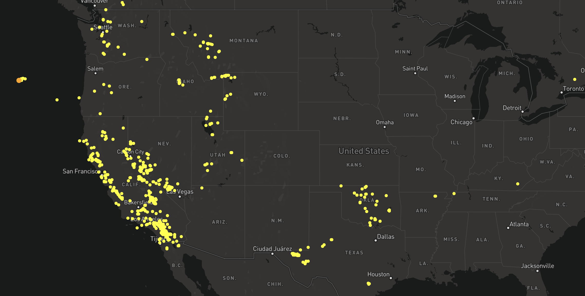

# Earthquake Visualization

This small project visualizes 7-day earthquake data from [the USGS free API](https://earthquake.usgs.gov/earthquakes/feed/v1.0/geojson.php) by displaying the locations of seismic activity. The color indicated magnitude with yellow being the smallest and red the largest.

## To Get Started

Get a free access token from MapBox api [here](https://account.mapbox.com/access-tokens/) and save it in your env file as `REACT_APP_MAPBOX`

Install the packages and then in the project directory, you can run:

### `npm start`

Runs the app in the development mode.\
Open [http://localhost:3000](http://localhost:3000) to view it in your browser.

The page will reload when you make changes.\
You may also see any lint errors in the console.

### `npm run build`

Builds the app for production to the `build` folder.\
It correctly bundles React in production mode and optimizes the build for the best performance.

The build is minified and the filenames include the hashes.\
Your app is ready to be deployed!

See the section about [deployment](https://facebook.github.io/create-react-app/docs/deployment) for more information.
